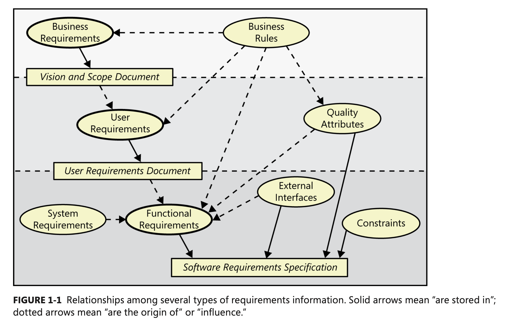

# Business Analysis and RE

----
# Learning Objectives
- situate BA in the RE process
- identify core BA activities

----
# Scope
There are many things typically outside the scope of the technical focus of software development.
- marketing
- customer support (typically outsourced)
- business strategy 
- HR
- accounting and return on investment
- other core business functions (e.g., making paper)

----
A business analyst is the role in the organization that sits in between technical software staff and the other parts of the organization

Other names include *requirements analyst, requirements engineer, systems analyst*

Often this role is subsumed within the scope of the Product Manager's tasks.

----
# Product Manager
(as distinct from Project Manager)
e.g. [Google's APM program](https://careers.google.com/programs/apm/) and [PM guide](https://producthq.org/career/google-product-manager/).

1. Conceptualize New Products and Create Product Roadmaps
2. Keep a Finger on the Pulse of the Market
3. Collaborate with Different Teams to Execute Strategy
4. Test Features of New Products
5. Develop and Execute Go-to-Market Strategies
6. Gather Feedback and Consistently Improve

  
Q: who would do this role at a startup? 

----
# Caveat: where does this belong?
- keep in mind the Cynefin domains, and software context.
- in software-centric organziations, the software IS the business
- in a startup with software emphasis, can't separate the software from the rest of the business
  
BA then primarily applies to organizations where software is perceived - rightly or wrongly - as a cost centre and ancillary to the main business function.

----
E.g., what does General Electric **do**?
- sell lightbulbs
- run powerplants
- software *supports* the business

----
But, what does General Motors do?
- design, build, and distribute cars
- run a highly profitable financing product (car loans)
- where does software fit? 

----
# The Business Analyst
> A business analyst enables change in an organizational context by defining needs and recommending solutions that deliver value to stakeholders.
> An analyst with a sound understanding of project management, development life cycles, risk management, and quality engineering can help prevent requirements issues from torpedoing the project.

Never hurts to understand the business context! Saying "we have a need to refactor and remove code clones" will sound a lot better as "we won't be able to deliver this feature by Christmas unless we fix the code first"

----
<iframe width="560" height="315" src="https://www.youtube.com/embed/fcIMIyQnOso" title="YouTube video player" frameborder="0" allow="accelerometer; autoplay; clipboard-write; encrypted-media; gyroscope; picture-in-picture; web-share" allowfullscreen></iframe>

----
# BA knowledge needs
See the [IIBA sample questions.](https://www.iiba.org/business-analysis-certifications/cbap/#sampleexam)

----
# Identifying Business Requirements

----
# Product Vision and Business Goals
Before we specify user stories and quality attribute scenarios, we need to understand *why* we do these things.
- otherwise cannot prioritize
- might actually be counter-productive

----
<!--
_backgroundColor: darkblue
_color: white
-->
Exercise: improving student registration

Individually, assess the **business goals** behind improving the university course registration system.
Then turn to your neighbor and share your idea.

----
# Building a vision and scope document
This is also known as a business case, business plan, marketing plan, project charter.

Let's look at Appendix C.

The book (page 82 and 87) has a sample template.

----
# Bringing it together: requirements types
* Quality attribute requirements
* Functional requirements
* Business goals

Label the following;
1. Achieve 10% return on investment within 6 months.
2. When the algorithm is triggered, it returns a result within 10 minutes 99% of the time.
3. Achieve positive cash flow on this product within 12 months.
4. As a user, I can click on the export button and save the file as a PDF to my computer.

----
# References
1. BA Body of Knowledge
2. Wiegers and Beatty, textbook
