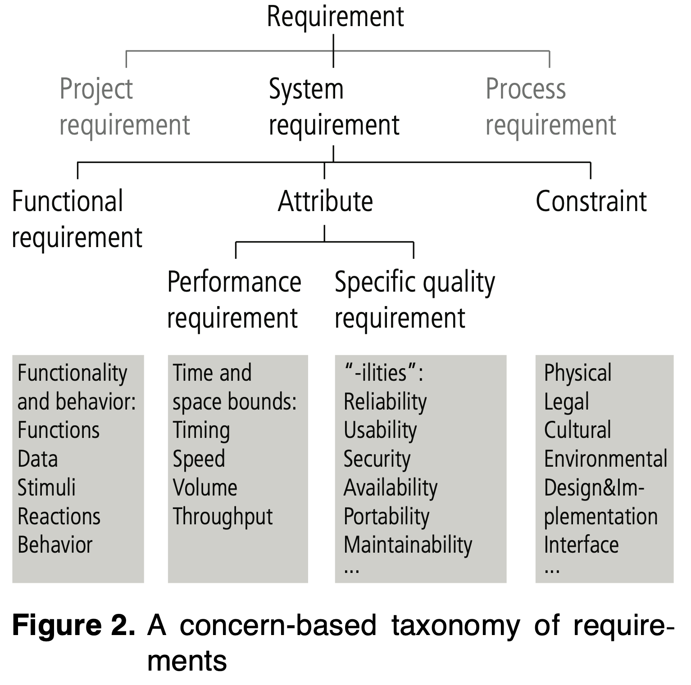

# Outline

Software quality and quality attributes

Non functional requirements
 
Making requirements measurable and some metrics

----
# Software quality

Different definitions in the literature, most emphasize the importance of conformance to requirements: 

> Conformance to explicitly stated functional and performance requirements, explicitly documented development standards, and implicit characteristics that are expected of all professionally developed software. 
[Pressman, 1997]

----
# Implications

Software *requirements* are the foundation from which quality is measured.  Lack of conformance to requirements is a lack of quality. 

Specified *standards* define a set of development criteria that guide the manner in which software is engineered. 

There is a set of implicit requirements that often go unmentioned (e.g. the desire for good maintainability).  

----
# Review: Functional vs. non-functional requirements

Functional requirements describe fundamental functions of the system  

Quality attribute requirements (QAR), aka non functional requirements (NFRs) describe  
 constraints on the system (e.g. reliability, portability, safety, performance) 
 constraints from the application domain (e.g. interface with existing systems in the organization) 

<!-- 
----
# Boehm’s NFR list[Boehm et al, 1978]

 -->

----
# Some definitions for QAR

- **Reliability**: The extent to which a program can be expected to perform its intended function with required precision.  
- **Efficiency**: The amount of computing resources and code required by a program to perform a function 
- **Integrity**: The extent to which access to software or data by unauthorized persons can be controlled. 
- **Usability**: The effort required to learn, operate, prepare input and interpret output of a program. 

----
- **Maintainability**: the effort required to test a program to ensure that it performs its intended function.  
- **Flexibility**: The effort required to modify an operational program. 
- **Portability**: The effort required to transfer a program from one hardware and/or software environment to another.  
- **Reusability**: The extent to which a program (or parts thereof) can be reused in other applications. 
- **Interoperability**: The effort required to couple one system with another.  

----
# Another view: Software quality and non-functional requirements 

> NFRs: The extent to which a system, component, or process meets customer or user needs or expectations 

[IEEE Glossary of Software Engineering Terminology]

----
# Glinz, On NFRs (Reading)

----
# Connect NFRs to Design

- NFRs often “architecturally significant”
- Get these wrong and cost/effort increase
- Frequently “fuzzy” and hard to sell to mgmt
- Soln: “quality attribute scenarios”
- Measurable, prioritized ‘tests’ of a system’s qualities

----
# Quality attribute scenarios (QAS)

In simple form:
**Quality attribute, stimulus, response, response measure**

> “Maintainability: when a new feature is added, the new feature is deployed in < 4 hours”
“Security: there is never any exposure of PII”
“Availability: servers in user’s region are unavailable within 100ms less than 1 hr a month

----
# Why QAS?

- Measurable = objective 
- Test design or implementation 
- Acceptance criteria: I won’t sign off on the payroll system until you meet the accuracy requirement 🙄

----
# Examples of Non Functional Requirements

- Performance requirements
- Reliability, e.g. system must have less than 1 hr downtime per year.
- Security, e.g. permissions for access
- time- or space related, e.g. the system must handle 1,000 transactions per second
- Survivability, e.g. the system must survive fire

<!-- ----
# Treatment of NFRs

Quality attributes (NFRs) and software quality criteria are interrelated
	E.g. correctness related to consistency

Product-oriented vs. process-oriented approaches to formally treat NFR’s

In a product-oriented approach, during design:
Identify the relative importance of each quality attribute (NFR)
Identify the design criteria on which these factors depend (software quality criteria) 
Make the requirements measurable.  -->

----
# Making requirements measurable

Difficult to do, but examples exist

----
# Making requirements measurable

Let’s focus on maintainability and reliability

----
# Software maintainability

Related to software complexity

Main cost in most installations, affected by data structures, logical structures, documentation and personnel attributes

Technical factors affecting maintainability
Module independence
Programming language
Software validation and testing
Quality and quantity of software documentation

----
# Software reliability

Besides maintainability, reliability is seen as one of the most important software attribute when quality is being assessed, as unreliable systems are discarded or never brought into use.  

Reliability metrics:

Probability of failure on demand: a measure of the likelihood that the system will behave in an unexpected way when some demand is made on it. 

It is most relevant for safety-critical systems and 'non-stop' systems whose continuous operation is critical. In these systems, a measure of fault occurrence is less important than the chance that the system will not perform as expected.  

Rate of fault occurrence (ROF): a measure of the frequency of occurrence with which unexpected behavior is likely to be observed. 

For example, if the ROCOF is 2/100 this indicates that two faults are likely to occur in each 100 operational time units. Appropriate time units may vary, depending on the system.  

Mean time to failure (MTTF): a measure of the time between observed failures.  

----
# 

Availability: a measure of how likely the system is to be available for use. 

For example, an availability of 998/1000 means that, in every 1000 time units, the system is likely to be available for 998 of these time units

Availability metric:

the ratio of observed uptime to the sum of the uptime and downtime: 
A = Tup / (Tup + Tdown)   (a single system) 

the ratio of systems up at some instant to the size of the population studied  (multiple systems).  

----
# Group exercise

In project teams:
Generate a list of relevant NFRs for your customer
Take 2 of those NFRs and create 2 simple scenarios.

Hint: “relevant” usually means “important to business success”

----
# In summary

----
# References

Pressman, R. Software Engineering: A practitioner’s approach, McGraw-Hill, 1997

Mylopoulos, J., Chung, L. and Nixon, B. Representing and using nonfunctional requirements: a process-oriented approach, IEEE Transactions of software engineering, 18(6), 1992

Boehm, B.W., Brown, J.R., Kaspar, M., and M. Lipow, Characteristics of Good Software, Amsterdam: North Holland, 1978 

