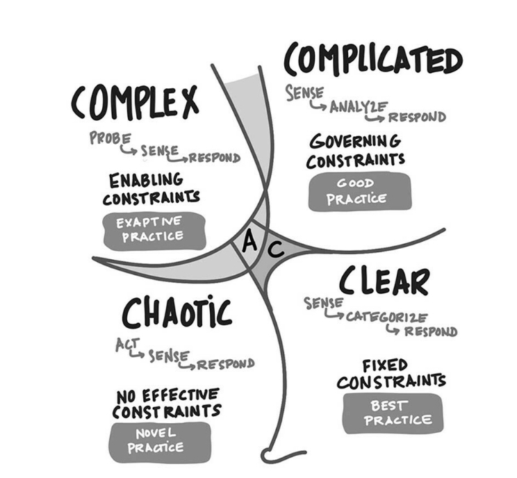

Learning Objectives
- correctly characterize the complexity of the problem 
- understand the practices relevant to that problem

----
<!-- We were joined by [Cijaye Depradine](https://twitter.com/imcijaye) and [Dave Snowden](https://twitter.com/snowded), founder of Cynefin. [Dave's blog](https://www.cognitive-edge.com/blog/) is great. Cijaye has an [excellent podcast](https://untappedgoldmines.com/). -->

----
**Clear** domain problems are ones where a waterfall process would work - "just go do it". 

Then the **Complicated** domain is one where experts can tell you what to do. There are timeboxes with max/min limits on the project, but no specified requirements. 

In the **Complex** domain you have no linear causal relationships - everything is deeply entangled. A software development approach like [Scrum](https://www.scrum.org/) can make these complex things complicated (good practices). 

----
To see what domain you are in, see if there are multiple competing explanations of the problem, each equally likely and *coherent* with the facts. That is complexity and you need to do safe to fail experiments. 

Otherwise, you might have good approaches from experts, or in the Clear domain, it is Clear what to do, e.g., what side of the road to drive on in the UK.

----
To solve customer problems in complex domains, we need to use techniques that are different from the Obvious domains (Clear and Complicated). There are 3:

1. **Triplets**, teams of new software developers, users, system architects, who can go out, observe problems, and quickly implement solutions. If you have 15 or so, you get information from 15 experiments on which approach is best. The "wisdom of the crowd" can help us by using the central limit theorem to converge on the right answer - see the example of the US nuclear submarine.
2. Use [RAD/JAD](RAD/JAD) to do rapid prototyping and development.
3. Look at the complexity alternative to design thinking and focus on the ecology of the problem space, the inarticulated needs. 
 
----
The user *may not know* what they want.

We want to avoid premature convergence / optimization of the solution. 

One problem is that we frequently deal with people who want the comfort of the Clear domain, hence overwrought frameworks like [SAFe](https://www.scaledagileframework.com/). They want [OKRs](https://felipecastro.com/en/okr/what-is-okr/) and [KPIs](https://www.klipfolio.com/resources/articles/what-is-a-key-performance-indicator) that are simple, while the problem is often not.

<!-- Finally, Cijaye suggested a focus on inquiry when tasked with solving a problem over forging blindly ahead--develop a skill for checking with the customer/client/project lead before irreversible errors are made. -->

<!-- Dave suggested focusing on a love of learning and reading - books on ethnography, ethics, classics.  -->