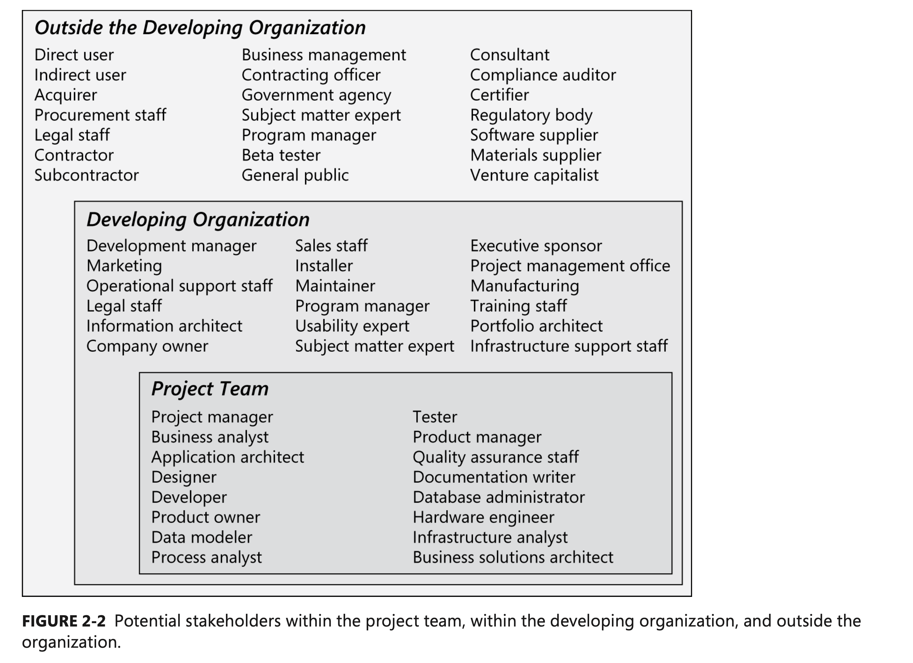

# Learning Objectives
- define and map stakeholders in a project
- characterize stakeholder roles
  
----
# Stakeholders

We've mentioned a few times that what matters is who the system is *for*, not what the system *does*. Of course, there are multiple different sets of interested parties. These are the stakeholders.

----
<!--
_backgroundColor: darkblue
_color: white
-->
# Exercise
Recall that 10 years ago they began a project to replace the Johnson St/Blue Bridge downtown. Who are the stakeholders in this project?

----

(see also Appendix C, 3.1)

----

One way to do Stakeholder mapping is to use a table from the Rozanski and Woods approach. It looks something like this:

| Role                  | Concerns                                                     | Instances |
| --------------------- | ------------------------------------------------------------ | --------- |
| Acquirers             | Oversee the procurement of the system or product             |           |
| Assessors             | Oversee the system’s conformance to standards and legal regulation |           |
| Communicators         | Explain the system to other stakeholders via its documentation and training materials |           |
| Developers            | Construct and deploy the system from specifications (or lead the teams that do this) |           |

----
| Role                  | Concerns                                                     | Instances |
| --------------------- | ------------------------------------------------------------ | --------- |
| Maintainers           | Manage the evolution of the system once it is operational    |           |
| Production  Engineers | Design, deploy, and manage the hardware and software environments in which the system will be built, tested,  and run |           |
| Suppliers             | Build and/or supply the hardware, software, or infrastructure on which the system will run |           |
| Support  Staff        | Provide support to users for the product or system when it is running |           |
| System Administrators | Run the system once it has been deployed                     |           |
| Testers               | Test the system to ensure that it is suitable for use        |           |
| Users                 | Define the system’s functionality and ultimately make use of it |           |

----
Why do we care about who the stakeholders are? These are the people with varying levels of need and interest in a system. At the least, we need to think about who the *documentation* stakeholders are. If we are doing a system design, we need to think about who should be consulted. And at the end of the project, **we evaluate success with respect to stakeholders.**

> A good architecture is one that successfully meets the objectives, goals, and needs of its stakeholders. (Rosanski and Woods)

----
Some stakeholders are more important than others. In one project I consulted for, stakeholder users wanted the search function to find the result in less time (it was taking *minutes*). They were used to Google speed (milliseconds), and yet, solving these problems turned out to be very complex.

Our requirements need to do different things for different people. Who the stakeholders are will help us determine that.

----
# References
1. Rozanski and Woods, "Software Systems Architecture", Pearson, 2012