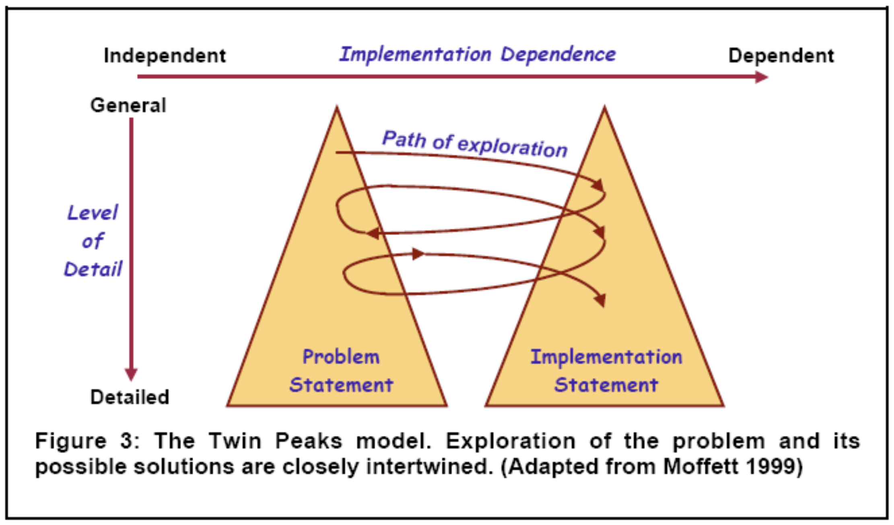
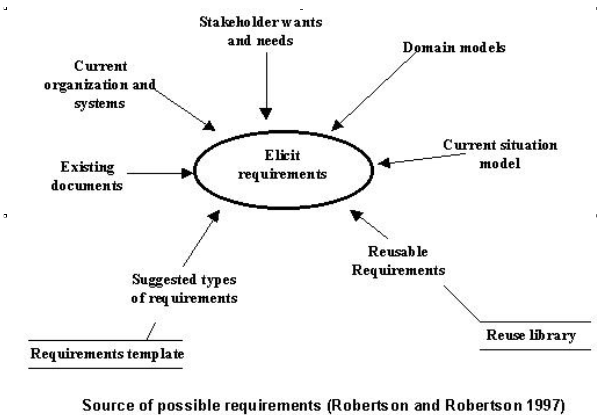

# Outline
Requirements describe problems
The what vs. how tension, and the role of the Reqts Spec

Sources of requirements
Types of requirements

----
# What is a requirement?

Requirement (def): 

> The effects that the client wishes to be brought about in the problem domain

Example: An elevator will only reverse direction when stopped at a floor

----
# Requirements Specification: Bridging two different worlds

----
# Example – distinction between a problem statement and solution statement

The requirements (for the machine): “prevent access to unauthorized personnel”

Domain properties: “only a manager can assign access authority”

Specification for the machine:  “when the user enters a valid password, the computer will unlock the door” (or “the system requires a login and password for access”)

----
# Another Example: requirements, domain property and the specification 

“The system (lift controller) will cycle the lift doors every time that a lift stops at a floor”

----
# Sources of requirements

----
# Types of requirements

Functional vs. non-functional, OR

- Functionality
- Physical environment
- Interfaces
- Users and human factors
- Documentation
- Data
- Resources
- Security
- Quality assurance

----
# Types of requirements: Functionality

- What will the system do? 
- When will de system do it? 
- Are there several modes of operation? 
- How and when can the system be changed or enhanced? 
- Are there constraints on execution speed, response time?(aka non-functional reqts) 

----
# Types of requirements: Quality assurance   

- What are the requirements for reliability, availability, maintainability, security? 
- What is the prescribed mean time between failures? 
- Is there a maximum time allowed for restarting the system after a failure? 
- What efficiency measures will apply to resource usage and response time?   

----
# Types of requirements: Security 

- Must access to the system or information be controlled? 
- How will one user's data be isolated from others? 
- How will user programs be isolated from other programs and from the operating system? 
- How often will the system be backed up?   

----
# Types of requirements: Physical environment 

- Where is the equipment to function? 
- Is there one location or several? 
- Are there any environmental restrictions, such as temperature, humidity or magnetic interference? 
 

----
# Types of requirements: Interfaces 

- Is the input coming from one or more other systems? 
- Is the output going to one or more other systems? 
- Is there a prescribed way in which the data must be formatted? 
- Is there a prescribed medium that the data must use?  

----
# Types of requirements: Users and human factors 

- Who will use the system? 
- Will there be several types of users? 
- What is the skill level of each type of user? 
- What kind of training will be required for each type of user? 
- How difficult will it be for a user to misuse the system? 

----
# Types of requirements: Documentation  

- How much documentation is required? 
- Should it be on-line in book format or both?  

----
# Types of requirements: Data  

- For both input and output, what should the format or the data be? 
- How often will they be received or sent? 
- How accurate must they be? 
- To what degree of precision must the calculations be made? 
- How much data flow through the system?   

----
# Types of requirements: Resources   

- What materials, personnel, or other resources are required to build, use, and maintain the system? 
- What skills must the developers have? 
- How much physical space will be taken up by the system? 
- Is there a prescribed timetable for development? 
- Is there a limit on the amount of money to be spent on development or on hardware and software?   

----
# Types of requirements: Design Constraints   

- Areas for design constraints include: 
- Target machines
- Underlying architecture
- GUI packages 
- Programming languages, algorithms 

----
# In this lecture

Discussed the difference between the How and What in software development

Discussed the multiple sources of requirements

Types of requirements and possible questions to ask in determining requirements

----
# References

Kurtz and Snowden, “New Dynamics of Strategy”, HBR.

Pfleeger, S. (1998): Software Engineering: Theory and Practice

Jackson,  M. (1997) The meaning of requirements, Annals of Software Engineering, vol. 3

Goguen, J. (1994) Requirements Engineering as the reconciliation of social and technical issues, in Requirements Engineering: Social and Technical issues, Academic Press

Robertson, S. and Robertson, J. (1999) Mastering the requirements process, Addison-Wesley

